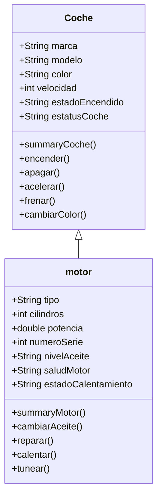

Diseña una clase que permita crear objetos simples, como un "Coche", aplicando POO; luego, define, al menos, tres atributos y tres métodos para dicho objeto, teniendo en cuenta los principios de encapsulación y abstracción.

Utiliza una herramienta para crear el diagrama de clases que represente la estructura del objeto del punto anterior, con base en los principios del UML; en el diagrama, incluye clases, atributos, métodos y relaciones entre clases.
